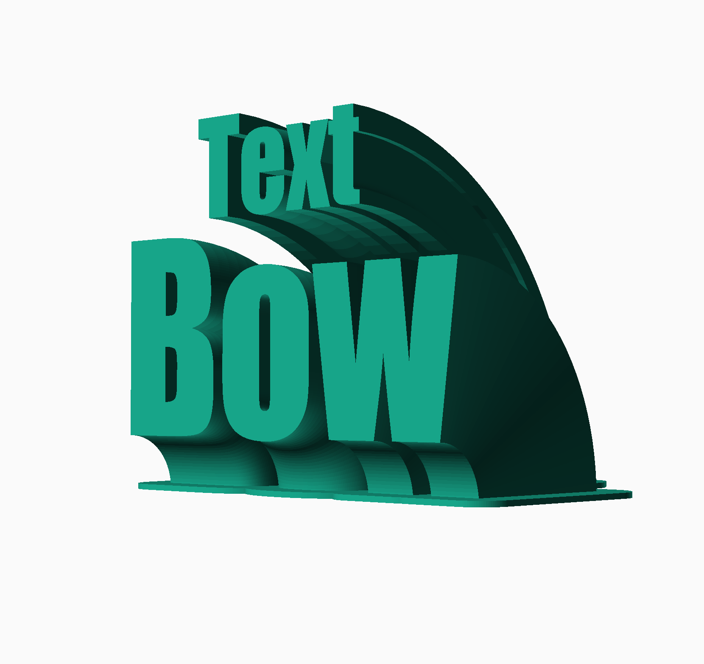

# scad-text-bow
Customizable Text Bow Labeling Tag

The Text Bow customizer lets you create one or two lined labeling tags for use on desks or walls.

## Use OpenSCAD

1. **Download and install:** [OpenSCAD](http://openscad.org/) version 2021.01 or newer
2. **Download:** The *.scad file of this model.
3. **Start** OpenSCAD and **open** the *.scad file in it.
4. **Open the customizer** via the menu "Window/Customizer"

Now you can configure the model and use the `F5` key to render the preview of your changes.

### Export your STL file

If you're done with your model settings, you can export the STL file:

1. Render the mesh by pressing the `F6` key.
2. Wait until the rendering is finished. This might take some minutes.
3. Export the STL file by pressing the `F7` key.

### Optionally save your configuration

If you like to use your configuration as a template for further models, it's a good idea, to save your configuration:

1. Click the `+` symbol in the customizer, which you find beside the configuration selector drop-down in the second line of the customizer.
2. Give your configuration a name.

Use the drop-down menu to access your saved configurations.

## Customizations

### Adjust positions

By adjusting positions, you can place overlapping text lines and even place one line besides or below the other.

### Angle

You can set the angle of the text bow.

_Note:_ Be aware of text bow angles larger than 60° concerning the need of support structures for the print.

### Distance

By setting the distance between the pivot point and the starting point of the text arc, you can adjust the radius of the bow.

### Hulled stand base

By setting the hulled stand base, you can even the shape of it. This is useful to fill holes in the stand base, if they influence the stability of the whole print.

### Sizing

You can set the font size, the height of the stand base and adjust further parameters to create large signs.

### Set number of fragments

You can use the advanced option "Number of fragments" to transform the shape of a bow to a straight line or a segment of lines by using low values. Note that the value also influences the quality of the typographic accuracy.

### Symbol Fonts

By selecting symbol fonts you can create icons in labeling tags.

_**Note:** You may need to download and install some fonts for the font selection to take effect._

# Good to know

## Fonts

As the font lists are not generated automatically, some font selections might not work on your machine. You also see a list of [Google Fonts](fonts.google.com). You can download fonts from the list and install them on your machine.

## Tips for better printability

* Use the stand base configuration to define a stable stand.
* Prefer upper-case letters over lower-case.
* Be aware of text bow angles larger than 60°
* Use a real caliper for better adjustments of font sizes and the resulting labeling tag.

